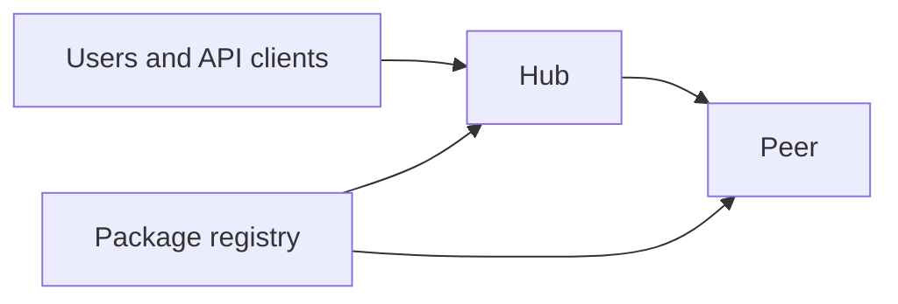

# Renglo

`renglo` is the operator command for a Renglo environment: stand up the cloud infrastructure, host or point at the package registries that infrastructure installs from, decide where each extension runs, and wire the CI/CD that keeps it current.

One file drives all of it. `renglo.yaml` lives at the **root of your BOM repository** and grows as you take on the four operator projects below. [docs/configuration.md](docs/configuration.md) documents every field.

People who write application code do not install this command. They receive the config (see: Project 1) and run the product in their own developer environment.

---

## First-time setup

First create the repository that will describe your environment: open **[renglo/example-bom](https://github.com/renglo/example-bom)** on GitHub, click **Use this template**, and name it `<your-env>-bom`. That repository is where `renglo.yaml` and the version pins live, and preparing it is the only manual step.

Then, from whatever directory you want this to live in, run these four lines:

```bash
mkdir -p ops && cd ops
git clone https://github.com/renglo/renglo-ops.git
bash renglo-ops/setup_venv.sh
renglo-ops/.venv/bin/renglo init
```

`init` asks seven questions, clones your BOM repository next to the tool, and writes both configuration files:

```text
Environment name: acme1
BOM repository on GitHub (ORG/REPO): acmeco/acme-bom
System email address: noreply@acme.com
System email identity type, email or domain [email]: email
AWS account id, blank to fill in later: 123456789012
AWS region [us-east-1]: us-east-1
AWS CLI profile on this machine, blank to decide later: acme-staging

cloning https://github.com/acmeco/acme-bom.git
wrote /path/to/ops/acme-bom/renglo.yaml
wrote /path/to/ops/.renglo/local.yaml

Done. This shell, and every new one:
  source renglo-ops/.venv/bin/activate
  renglo status
```

Run those last two lines. `renglo status` should print your environment name, GitHub repo, and staging account. Setup is finished; everything below is either reference or one of the four projects.

### What you ended up with

```text
ops/
├── renglo-ops/         two sibling packages: cli/ (`renglo`) and lib/ (`renglo-ops`)
├── acme-bom/           your environment: renglo.yaml, version pins, deploy workflows
└── .renglo/local.yaml  this machine only: which BOM to use, which AWS profile
```

`ops` is just the name this README picked; nothing in the code looks for it, and you can put the two repositories anywhere. `init` writes `renglo.yaml` into the BOM checkout and `.renglo/local.yaml` into the directory above it, so if you already cloned the BOM elsewhere, point at it: `renglo init --bom /path/to/acme-bom`.

Commit and push `renglo.yaml` whenever you like — nothing local waits on it. `.renglo/local.yaml` stays on this machine, and `init` gitignores it for you.

`setup_venv.sh` also puts the AWS CDK CLI inside the venv, so activating it gives you both `renglo` and `cdk`. Deploying to an account additionally needs an AWS CLI profile for it; that part is per-account, not per-machine, and [Project 1](docs/project-1-greenfield.md) covers it.

### Updating renglo-ops

New features land here regularly, so update every week or two. Two commands, run from the folder holding the clone (`ops/` in the example above):

```bash
git -C renglo-ops pull
bash renglo-ops/setup_venv.sh
```

`setup_venv.sh` is safe to re-run: it reuses the existing venv and refreshes the dependencies and the CDK CLI in place. Your `renglo.yaml` and `.renglo/local.yaml` are untouched, since neither lives in this repository. Re-activate the venv afterwards only if the shell was already using it.

---

## Operator projects

Four projects, days or weeks apart. `renglo.yaml` is the input to every one of them.


| Project                          | You end up with                                                                                            | Doc                                                          |
| -------------------------------- | ---------------------------------------------------------------------------------------------------------- | ------------------------------------------------------------ |
| **1. Greenfield infrastructure** | Every AWS service for one environment is operational, and the config files for running the product locally | [docs/project-1-greenfield.md](docs/project-1-greenfield.md) |
| **2. Registry**                  | A private Python and npm registry you host, and read access to registries you pull from                    | [docs/project-2-registry.md](docs/project-2-registry.md)     |
| **3. Additional infrastructure** | Each extension placed on the hub or on a peer, installing from a known registry                            | [docs/project-3-extensions.md](docs/project-3-extensions.md) |
| **4. CI/CD**                     | The BOM repository deploys on a push to `main`, so a release train rolls without a laptop                  | [docs/project-4-pipeline.md](docs/project-4-pipeline.md)     |


These are projects, not stages. You come back to them. Placement changes after an extension outgrows the hub, a new registry appears, the pipeline gets another tenant.

Some of them never happen. An environment that installs only external packages skips Project 2. A proof of concept that runs locally against real cloud infrastructure, and is never deployed by CI, stops after Project 1 or 3.

```bash
renglo help
renglo help greenfield
renglo help registry
renglo help extensions
renglo help pipeline
```

Release trains stay in git-convoy. This command does not regenerate a BOM.

---

## What you are operating

A running Renglo system is one **hub**, any number of **peers**, and the **registries** those machines install packages from.




The **hub** is the API every client talks to. It authenticates requests and routes work. Two CloudFormation stacks sit under it:


| Stack | What it is                                   | When you touch it                          |
| ----- | -------------------------------------------- | ------------------------------------------ |
| **A** | Core platform: auth, mail, storage, identity | New environment, or a change to that core  |
| **B** | Hub-side extension infrastructure            | Hub-placed extensions, blueprints, hub IAM |


A **peer** is a worker with its own compute and permissions. The hub forwards a job and gets a result back. Peers do not talk to clients. Each peer is its own stack, named `{env}-peer-{peerId}`. A peer usually exists because something did not fit on the hub.

A **registry** is a private Python and npm store in CodeArtifact, plus a GitHub login so a version tag on a product repo publishes that version. The account that hosts it is often not the account that runs the hub.

A **handle** is the short name of an extension (`data`, `schd`). An extension runs in one place: on the hub, or on one peer.

---

## Where the files live

Three files. The command finds two of them on its own; the third you always name. Field-by-field guide: [docs/configuration.md](docs/configuration.md).

### `renglo.yaml` — one environment

At the top level of the BOM checkout: `ops/acme-bom/renglo.yaml` in the layout above. `init` writes it there, and you commit it to the BOM repository.

`renglo` locates it by walking **up** from the directory you are standing in, so anywhere inside the BOM checkout works. `RENGLO_TENANT`, set to the absolute path of the file, replaces that search; CI uses it because there is no machine file there.

`github.repo` inside it is explicit rather than read from the checkout. OIDC and SSM must not trust whatever `origin` this laptop happens to have. `renglo config check` compares the two and tells you when they differ.

### `.renglo/local.yaml` — this machine

In the directory that **contains** the BOM checkout: `ops/.renglo/local.yaml` when the BOM is `ops/acme-bom`. The exception is a product workspace — a directory holding both `console/` and `dev/` — somewhere above the BOM; then the file goes at that workspace root, and its `tenant:` is the path down to the BOM (`tenant: ops/acme-bom`).

Found by the same walk up, which is why running `renglo` from the BOM checkout or from the product workspace both work. Never committed: `init` adds `.renglo/` to the `.gitignore` of whichever repository owns that directory. Synth output and generated previews land under the same `.renglo/`.

### `registry.yaml` — one CodeArtifact stack you host

[Project 2](docs/project-2-registry.md) only, and the one file with no location of its own, because nothing ever searches for it. You give the path, and the first of these wins:

1. `--registry PATH` on `renglo registry deploy`, `renglo registry show`, or `renglo registry check`
2. `RENGLO_REGISTRY` in the environment
3. `registry:` in `.renglo/local.yaml`, which is how you stop typing the flag

A relative path resolves against the current directory, so make the `local.yaml` entry absolute.

Commit it in a repository owned by the org that owns the registry's AWS account, one file per registry — not in an environment's BOM repo, because a single registry serves many environments.

### Generated app config

`dev/renglo-api/env_config.py` and `console/.env.development` are not operator input; `renglo state local-config --apply` writes them from the live environment. They land in a **product** workspace, and the command refuses to write into the `renglo-ops` checkout or into `site-packages`.

---

## Operating a running environment

The four projects above change desired state in `renglo.yaml` and deploy it. Once an environment exists, most of the work is watching and adjusting what is already running. Those commands are not tied to a project. `renglo help operate` lists them. Field-level usage is in [docs/operator.md](docs/operator.md).

`renglo status` still prints the file. `renglo status --live` adds CloudFormation for stack A, stack B, and each peer, plus the sender and API URL currently in SSM. `renglo state show` is still the YAML document. `renglo state live` is the SSM document the running API reads. Stack deploy writes that SSM parameter; there is no separate publish step.

Placement stays an edit to `renglo.yaml`. `renglo extension tree` and `renglo peer list` only read that file. `renglo peer deploy` and `renglo stack deploy --stack` apply it. Pins and releases stay with git-convoy.

```bash
renglo status --live
renglo stack status
renglo peer list
renglo extension tree
renglo email sender-status
renglo admin create you@example.com --console staging
```

---

## Command reference

Global flag: `--profile NAME` selects the AWS CLI profile for that invocation. When you omit it, the command uses `AWS_PROFILE`, then `profile` in `.renglo/local.yaml`.

### `renglo help [greenfield|registry|extensions|pipeline|operate]`

Lists the commands used in one project. With no argument, lists the projects and a one-line description of each command. Every command stays available either way.

### `renglo init`

Asks for the environment name, BOM repository on GitHub, system email address, system email identity type, AWS account, region, and AWS profile. Clones the BOM repository if it is not on disk yet, writes `renglo.yaml` at its root, and writes `.renglo/local.yaml` for this machine.

The BOM location is guessed from where you run the command (the checkout you are in, a sibling of `renglo-ops`, or a folder named after the repo); `--bom PATH` sets it explicitly. A `renglo.yaml` that still holds template placeholders is replaced without asking, while one that already describes an environment is kept unless you pass `--force`. Every question has a flag — `--name`, `--github-repo`, `--email-from`, `--email-identity`, `--account`, `--region`, global `--profile` — and `--no-input` turns off prompting for scripts. `renglo config init` is the same command.

### `renglo doctor`

Runs a checklist: BOM checkout and machine file, whether `renglo.yaml` loads, CDK and AWS CLI tooling, profile and STS credentials, readiness hints for projects 1–4, and common mismatches (for example `github.repo` vs `origin`). Exits with code 1 when any check fails.

### `renglo status`

Environment name, GitHub repo, platform package version, release pins, which accounts are enabled, and the AWS profile in use. `--live` also prints CloudFormation and SSM for the running account. See [docs/operator.md](docs/operator.md).

### `renglo state show`

Prints the loaded `renglo.yaml` as JSON.

### `renglo state local-config [--apply] [--dry-run] [--region REGION]`

Reads the live environment and writes the config files needed to run the API and console outside the cloud. See [docs/project-1-greenfield.md](docs/project-1-greenfield.md#6-hand-off-the-local-config).

### `renglo config check`

Loads `renglo.yaml` and compares `github.repo` with the BOM checkout's `origin`.

### `renglo stack deploy [--stack a|b|a,b] [--dry-run]`

Synths the hub from `renglo.yaml`, then runs `cdk deploy` for the stacks you name. The default is `a,b`. See [docs/project-1-greenfield.md](docs/project-1-greenfield.md) and [docs/operator.md](docs/operator.md).

### `renglo peer deploy [--peer-id PEER] [--dry-run]`

Synths peer stacks from `renglo.yaml`, then runs `cdk deploy`. `--peer-id` limits the synth to one peer. See [docs/project-3-extensions.md](docs/project-3-extensions.md).

### `renglo registry deploy [--registry PATH] [--dry-run]`

Synths the registry stack from `registry.yaml`, then runs `cdk deploy`. Without `--registry` it falls back to `RENGLO_REGISTRY`, then `registry` in `.renglo/local.yaml`, and exits when none of the three is set. Refuses the `default` AWS profile. See [docs/project-2-registry.md](docs/project-2-registry.md).

### `renglo registry show [--registry PATH] [--region REGION]`

Reads the deployed publisher stack in AWS and prints outputs plus the GitHub Actions variables for product repos. Uses the same registry path resolution as deploy. Pass `--profile` or `AWS_PROFILE` for the **registry** account (not the hub). Refuses the `default` profile.

### `renglo registry check PACKAGE VERSION [--format python|npm] [--registry PATH] [--region REGION]`

Asks CodeArtifact whether that version is published. Exit 0 when a revision is `Published`; exit 1 when the package or version is absent, or present but not published. A name starting with `@` is checked as npm; otherwise it is a Python package. A leading `v` on the version is ignored, so `v1.0.1` checks `1.0.1`. Uses the same registry path and AWS profile as `renglo registry show`.

### `renglo publish [--path DIR] [--dry-run]`

Builds the package in `DIR` with `python -m build` and uploads it with `twine`. The usual release path is a git tag on the product repo, described in [docs/project-2-registry.md](docs/project-2-registry.md#process-3--the-developer-releases-a-version). Use this command when you are publishing by hand.